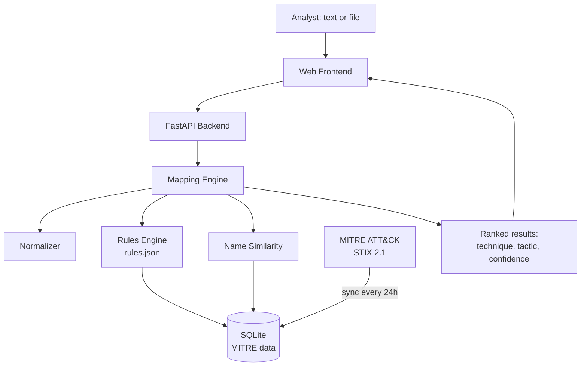

<div align="center">

# 🛡️ MITRE ATT&CK Mapping Tool

**Turn raw security logs, command lines and threat descriptions into MITRE ATT&CK techniques, tactics and confidence scores.**


</div>

---

## 📖 Overview

SOC analysts face a constant stream of alerts such as `powershell.exe -enc ...` or `mimikatz.exe "sekurlsa::logonpasswords"`. Working out what each one means in ATT&CK terms is slow and repetitive.

This tool automates that first step. Paste text or upload a log, and it returns the likely **technique**, its **tactic**, the **matching indicators** and a **confidence score**, so the analyst can move straight to investigating.

> It assists analysts; it does not replace them. Confidence is a heuristic score produced by this tool, **not** a value published by MITRE.

**Example**

```text
Input:   mimikatz.exe "sekurlsa::logonpasswords"

Output:  T1003.001  LSASS Memory
         Tactic:      Credential Access
         Confidence:  90%
         Indicators:  mimikatz, sekurlsa, logonpasswords
```

## ✨ Features

- 🔎 **Rule-based mapping** using an editable JSON rule set (37 techniques included)
- 🧠 **Technique-name similarity** to catch plain-English descriptions
- 📊 **Ranked results** with tactic, confidence, indicators and a MITRE link
- 📁 **File analysis** for `.txt`, `.log`, `.csv` and `.json` (1 MB limit)
- 🔄 **MITRE STIX 2.1 sync** into SQLite, automatic every 24 hours or on demand
- 🕑 **History and export** of past analyses as JSON or CSV
- 🌐 **REST API** with interactive Swagger docs at `/docs`
- 🐳 **Docker support** and a lightweight web UI

## 🏗️ Architecture



**How a request flows:** normalize the text, match indicators from the rules, score name similarity against the technique database, merge and rank, then store in history and return JSON.

## 🚀 Quick Start

```bash
git clone https://github.com/ragesh18/Mitre-mapper.git
cd mitre-attack-mapping-tool

python -m venv .venv
source .venv/bin/activate        # Windows: .venv\Scripts\Activate.ps1
pip install -r requirements.txt

uvicorn backend.app.main:app --reload
```

Then open:

| URL | Purpose |
|---|---|
| http://localhost:8000 | Web interface |
| http://localhost:8000/docs | Interactive API documentation |

On first start the app creates `data/mitre.db`, loads a small offline set of techniques, and then downloads the full MITRE dataset in the background. If you are offline, it keeps working with the small set.

### Docker

```bash
docker compose up --build
```

## 🧪 Try It

Paste any of these into the web UI:

| Input | Expected technique |
|---|---|
| `mimikatz.exe "sekurlsa::logonpasswords"` | T1003.001 LSASS Memory |
| `powershell.exe -enc SGVsbG8=` | T1059.001 PowerShell |
| `cmd.exe /c whoami` | T1033 System Owner/User Discovery |
| `vssadmin delete shadows /all /quiet` | T1490 Inhibit System Recovery |
| `wevtutil cl Security` | T1070.001 Clear Windows Event Logs |

Sample files for upload are in [`test_data/`](test_data/), including a 13-line simulated attack chain (`attack_chain.log`).

```bash
curl -F "file=@test_data/attack_chain.log" http://localhost:8000/api/v1/map/file
```

## 🔌 API Reference

| Method | Endpoint | Description |
|---|---|---|
| `POST` | `/api/v1/map` | Analyze text: `{"text": "...", "top_n": 10}` |
| `POST` | `/api/v1/map/file` | Analyze an uploaded `.txt`, `.log`, `.csv` or `.json` file |
| `GET` | `/api/v1/techniques` | Search techniques (`?q=`, `?tactic=`, `?limit=`) |
| `GET` | `/api/v1/techniques/{attack_id}` | Get one technique, e.g. `T1082` |
| `GET` | `/api/v1/history` | List previous analyses |
| `GET` | `/api/v1/export/{id}?format=json\|csv` | Export an analysis |
| `POST` | `/api/v1/admin/sync` | Re-sync MITRE data (needs `X-Admin-Token` if configured) |
| `GET` | `/api/v1/health` | Health check |

**Example response**

```json
{
  "analysis_id": 1,
  "count": 1,
  "results": [
    {
      "attack_id": "T1003.001",
      "name": "LSASS Memory",
      "tactics": ["Credential Access"],
      "confidence": 90,
      "indicators": ["mimikatz", "sekurlsa", "logonpasswords"],
      "methods": ["rule"],
      "url": "https://attack.mitre.org/techniques/T1003/001/"
    }
  ]
}
```

## 📂 Project Structure

```text
mitre-attack-mapping-tool/
├── backend/app/
│   ├── api/routes.py          # REST endpoints
│   ├── core/config.py         # Settings (env vars)
│   ├── db/                    # SQLAlchemy models and session
│   ├── engine/                # normalizer, rules, mapper
│   ├── services/              # MITRE sync and scheduler
│   └── main.py                # App entry point
├── frontend/index.html        # Web UI
├── rules/rules.json           # Mapping rules (editable)
├── scripts/sync_mitre.py      # Manual MITRE sync
├── test_data/                 # Sample logs and inputs
├── tests/                     # Unit and API tests
├── Dockerfile
└── docker-compose.yml
```

## ⚙️ Configuration

Set these as environment variables:

| Variable | Default | Description |
|---|---|---|
| `AUTO_SYNC` | `true` | Sync MITRE data at startup and on a schedule |
| `SYNC_INTERVAL_HOURS` | `24` | Hours between syncs |
| `ADMIN_TOKEN` | *(empty)* | If set, required to call `/admin/sync` |
| `MAX_UPLOAD_BYTES` | `1000000` | Maximum upload size |
| `MAX_TEXT_CHARS` | `200000` | Maximum text length analyzed |
| `DATABASE_URL` | local SQLite | Database connection string |
| `STIX_URL` | MITRE GitHub | Source of ATT&CK STIX data |

## ➕ Adding Your Own Rules

Append an entry to `rules/rules.json` and restart:

```json
{
  "attack_id": "T1059.001",
  "name": "PowerShell",
  "tactics": ["Execution"],
  "indicators": ["powershell.exe", "-encodedcommand"],
  "weight": 0.75
}
```

`weight` is the confidence when a single indicator matches. Each extra matching indicator adds 5 points, up to a cap of 97%.

## 🔒 Security

- Input is treated as **text only** and is never executed
- Database access goes through the ORM (parameterized queries)
- Uploads are limited by file extension and size
- CSV exports neutralize spreadsheet formula injection
- The UI renders results with `textContent`, so pasted markup is not interpreted
- Set `ADMIN_TOKEN` before exposing the sync endpoint

For production, also add authentication, rate limiting and audit logging.

## ✅ Testing

```bash
pytest -q
```

Covers the mapping engine, STIX parsing, word-boundary handling, benign and hostile input, and the API (validation, upload checks, export).

## ⚠️ Limitations

- Matching is keyword and name based. It cannot understand meaning, so differently worded descriptions may be missed.
- Rules cover 37 techniques, not the full ATT&CK matrix.
- Confidence scores are heuristic and should guide, not decide, an investigation.

## 🗺️ Roadmap

- [ ] **V2:** sentence-transformer embeddings with FAISS or ChromaDB for semantic matching, plus LLM-written explanations
- [ ] **V3:** Wazuh and Splunk ingestion, Sigma rules, ATT&CK Navigator export, authentication and role-based access, analyst feedback

## 🙏 Acknowledgements

- [MITRE ATT&CK®](https://attack.mitre.org/) and the [ATT&CK STIX data](https://github.com/mitre-attack/attack-stix-data)
- [FastAPI](https://fastapi.tiangolo.com/) and [SQLAlchemy](https://www.sqlalchemy.org/)

MITRE ATT&CK® is a registered trademark of The MITRE Corporation. This project is not affiliated with or endorsed by MITRE.

## 📄 License

Add a license of your choice (for example MIT) in a `LICENSE` file.
